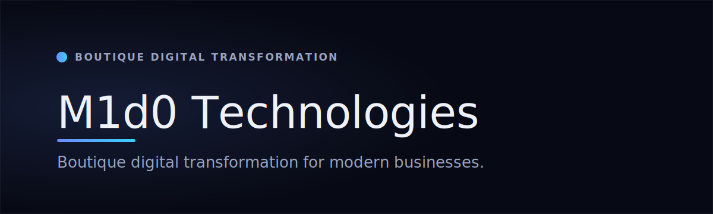

  

  
  
  

# M1D0 Technologies

> **Boutique digital transformation for modern businesses.**
> Strategy, software, automation, infrastructure, and practical implementation — for companies ready to modernize.

M1D0 Technologies is the **software and digital‑transformation arm of the Dahhan Enterprises group** — and an IT consulting and managed‑services partner for organizations that want to modernize. One accountable team carries the same engineering thinking from the first decision through to production operation, across six divisions.

The public site serves a marketing surface today; an invite‑only customer portal runs on a dedicated subdomain.

## Six divisions, one accountable team

| Division | Focus |
|---|---|
| **M1D0 Systems** | Cloud infrastructure, DevOps & platform engineering, server/network operations, managed IT, observability, self-hosting, data engineering |
| **M1D0 Digital** | Custom web platforms & full-stack applications, ecommerce & digital presence, UI/UX & design systems |
| **M1D0 Security** | Identity & access management, cybersecurity engineering, disaster recovery & continuity, incident-response readiness, SOC 2 / ISO 27001 readiness |
| **M1D0 Integrations** | Workflow automation & orchestration, ERP / CRM & business-process automation |
| **M1D0 Transformation** | Digital-transformation consulting, technology strategy & architecture roadmaps, fractional / vCTO, staff augmentation |
| **M1D0 Labs** | Applied AI R&D — prototypes, LLM application experiments, ML platform research |

→ Full service detail: **[docs/services.md](./docs/services.md)**

## Why teams work with us

- **Engineering-led** problem solving over theoretical advice
- **Strategy through to operation** in one lifecycle — not a hand-off
- A **partnership model**, not a one-off vendor relationship
- Built for **efficiency, effectiveness, and operational resilience**

## Tech stack

  
  
  
  
  
  
  
  

Next.js 16 (App Router, RSC) · React 19 · TypeScript 6 · Tailwind CSS v4 · Directus CMS · PostgreSQL + Drizzle · better-auth · self-hosted behind Caddy + Cloudflare. Engineered for performance (ISR, standalone output), SEO, and a hardened security posture (per-request CSP nonce, strict response headers).

## Links

- 🌐 **Live:** [www.m1d0.com](https://www.m1d0.com) &nbsp;·&nbsp; 🟡 *Launching soon — maintenance-gated until owner-approved release*
- 🏛️ **Group:** [M1D0 Technologies on GitHub](https://github.com/M1D0-Technologies)
- ⚙️ **How we build:** [`platform-engineering`](https://github.com/M1D0-Technologies/platform-engineering)
- ✉️ **Contact:** contact@m1d0.com

---

Part of the **Dahhan Enterprises** group · operated by **M1D0 Technologies**. Documentation-only showcase — product source is private. © 2026 Dahhan Enterprises LLC — M1D0 Technologies, Dahhan Industries, Miss Dantella and affiliated brands. All rights reserved.
